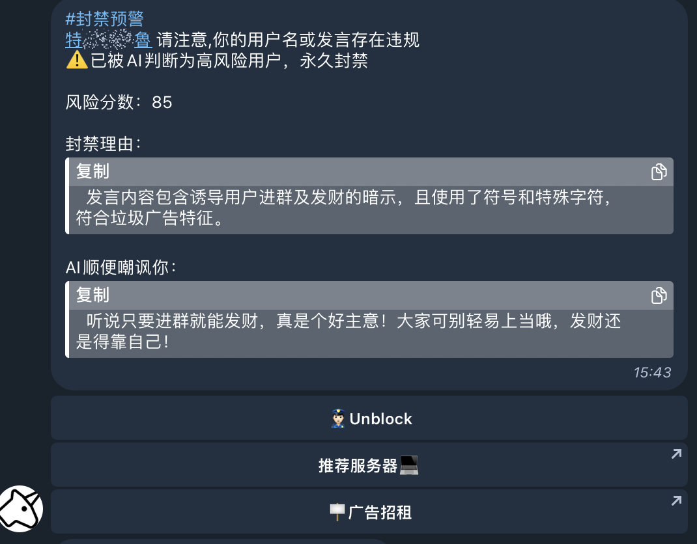

# ai-anti-bot

Anti-spam robot for [Telegram](https://telegram.org/) groups

<p align="center">
<a href="https://opensource.org/licenses/MIT"></a>
<a href="https://golang.org"></a>
<a href="https://github.com/tucnak/telebot"></a>
</p>

`Telegram`是全球知名的且非常方便和优雅的匿名通讯工具    
但由于该软件的匿名性，导致在群组内经常出现很多的垃圾推广信息，我们没有办法每时每刻的去识别群组内的是否有出现垃圾信息   
还好`Telegram`为我们提供了非常强大的`Api`，现在我们可以利用`人工智能`去自动帮我们检测用户的行为


如果你是`Telegram`的群组管理员，你可以直接私有化部署本项目     
如果你是`开发者`，你可以利用本项目熟悉`Go语言`与`Telegram`的交互式开发，以便后续利用`Api`开发出自己的机器人！

## 参考：   
- Telegram Api: [https://core.telegram.org/bots/api](https://core.telegram.org/bots/api)
- Telebot: [https://github.com/tucnak/telebot](https://github.com/tucnak/telebot)
- go-openai: [https://github.com/sashabaranov/go-openai](https://github.com/sashabaranov/go-openai)

## 使用方式

### Docker Compose

```shell
# 克隆项目
git clone https://github.com/assimon/ai-anti-bot.git && cd ai-anti-bot && mkdir data

# 创建配置文件
cp config.yml.example data/config.yml

# 根据你的需要配置机器人
vi config.yml

# 一键启动
docker compose up -d
```
非常Jer简单，对吧?😄

## 配置
```yml
telegram:
  proxy:
  token: ""     # 机器人token
  groups: [""]  # 运行机器人生效的群组id，可配置多个，英文逗号分割
  owners: [""]  # 超级管理员id，可配置多个，英文逗号分割
identification_model: "chatgpt"
clean_bot_message: true # 定时清理机器人消息

# 下面是判断策略，比如
# 下面配置项的含义是：如果你入群超过3天，发言超过3次或者已经验证过1次，就不需要再验证了。
# 这个是为了节省你的token，没必要无时无刻检测😊
strategy:
  joined_time: 3
  number_of_speeches: 3
  verification_times: 1
  
chatgpt:
  proxy: ""   # openai的代理地址，没有就不填写
  apikey: ""  # apikey
  model: "gpt-4o-mini"   # 要使用的检测模型。请注意，gpt4 以下版本不支持图像和文件交互。

# 如果您的母语不是中文而是其他语言，
# 请使用翻译将以下提示替换为您所需的语言。
prompt:
   ...
```

### 其他命令
```
/start       # 存活检测：机器人服务运行正常，会进行反馈

# 我们也可以使用下面的命令来为机器人添加我们自己的广告按钮，但请务必配置telegram.owners选项

/add_ad     #添加新广告，格式：广告标题|跳转链接|过期时间（以时，分，秒为单位）|权重（按降序排列，数值越大，权重越高），例如：/add_ad Hello|https://google.com|2099-01-01 00:00:00|100

/all_ad     # 查看所有广告

/del_ad     # 删除广告按钮，例如：/del_ad 1（删除id为1的广告）
```

## Preview
